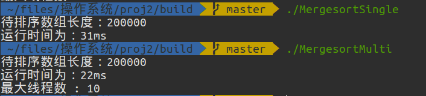
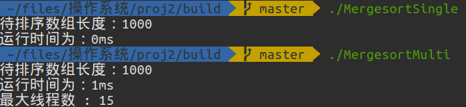
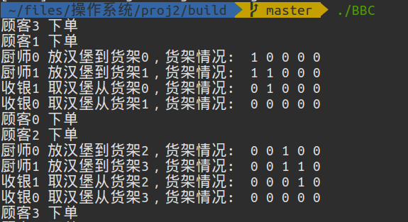

# 第二次实验报告

​		姓名：刘琎

​		学号：516020910128

---

[TOC]

## 1. 分别用单线程和多线程实现归并排序

程序文件：MergesortSingle.c，MergesortMulti.c

运行结果：当数组很大的时候，多线程运行的时间较短；当数组较小的时候，单线程运行的时间较短。如下图所示：

<figure class="half">
    
    
</figure>


## 2. 多线程信号量练习

伪代码：

```c
Cooks process：	
while(true){
    wait(empty_sem);
    wait(mutex1);
    	放一个汉堡;
    signal(mutex1);
    signal(full_sem);
};

Cashiers process :
while(true){
    wait(order_sem);
    wait(full_sem);
    wait(mutex1);
    	取走一个汉堡;
    signal(mutex1);
    signal(empty_sem);
    signal(cash_sem);
};

Customers Process:
while(true){
    wait(cash_sem);
    	顾客发起一个订单;
    signal(order_sem);
}
```

运行结果：



## 3. 工程目录

```bash
proj2
├── build  # 用于外部编译的文件夹
│   └── Makefile  # makefile
├── BurgerBuddies.c  # 信号量
├── CMakeLists.txt   
├── MergesortMulti.c  # 多线程归并
├── MergesortSingle.c  # 单线程归并
├── pics  # 图片
│   ├── bbc.png
│   ├── 大数组排序.png
│   └── 小数组排序.png
├── Prj2README  
└── 第二次实验报告.md
```


​       